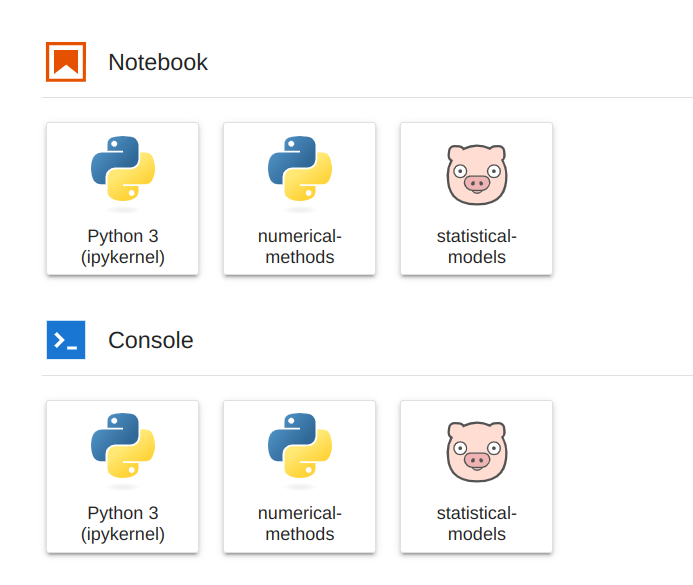
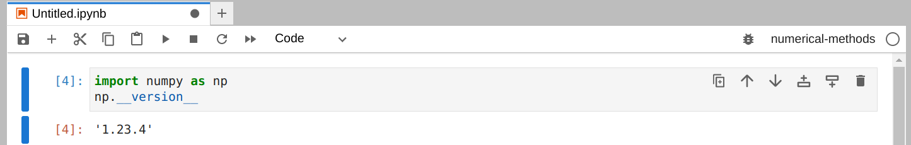
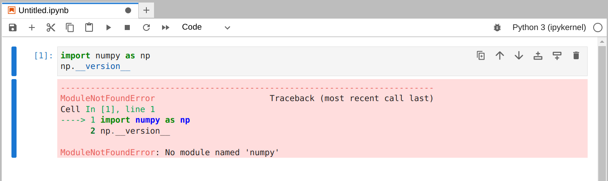
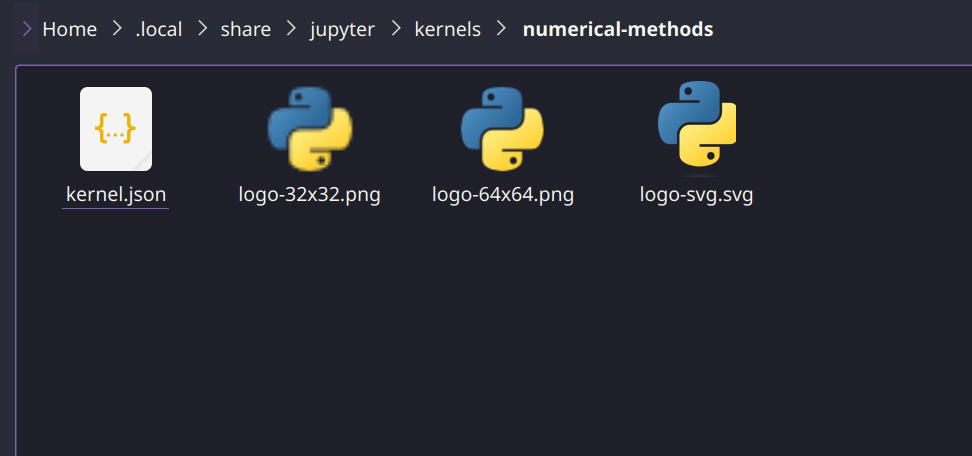

# Install a virtual environment and use it as a kernel

## Create a virtual environment

We move in a folder and create a virtual environment named numerical-methods

```bash
cd VirtualEnvironments
python3 -m venv numerical-methods
```

Activate it with

```bash
~/VirtualEnvironments$ source numerical-methods/bin/activate
```

The output will be the follow

```bash
(numerical-methods) mancio@Dell:~/VirtualEnvironments$
```

Now the virtual environment is now activated.

For deactivate it just input the command

```bash
(numerical-methods) mancio@Dell:~/VirtualEnvironments$ deactivate
mancio@Dell:~/VirtualEnvironments$ 
```

The virtual environment must be activated for using the installed modules, however it will not work as a kernel in Jupyter yet.

## Link it to a kernel

Install in the virtual environment ipykernel

```bash
(numerical-methods) mancio@Dell:~$ pip install ipykernel
```

Add the virtual environment to Jupyter with

```bash
(numerical-methods) mancio@Dell:~$ python -m ipykernel install --user --name=numerical-methods

```

The output will be something like this

```
Installed kernelspec numerical-methods in /home/mancio/.local/share/jupyter/kernels/numerical-methods
```

Now let's install matplotlib and numpy with

```bash
(numerical-methods) mancio@Dell:~$ pip install matplotlib
```

We can now deactivate the virtual environment and open Jupyter Lab

```
(numerical-methods) mancio@Dell:~$ deactivate
mancio@Dell:~$ jupyter-lab
```

A page in the browser will open up and we can see our Kernel



Choose the kernel that we created and try to import numpy



If we change the kernel with the standard one we obtain



## Unlink or delete a kernel

To list and delete a kernel we input the following command

```bash
mancio@Dell:~$ jupyter kernelspec list
Available kernels:
  numerical-methods     /home/mancio/.local/share/jupyter/kernels/numerical-methods
  python3               /home/mancio/.local/share/jupyter/kernels/python3
  statistical-models    /home/mancio/.local/share/jupyter/kernels/statistical-models
mancio@Dell:~$ jupyter kernelspec uninstall statistical-models
Kernel specs to remove:
  statistical-models    /home/mancio/.local/share/jupyter/kernels/statistical-models
Remove 1 kernel specs [y/N]: y
[RemoveKernelSpec] Removed /home/mancio/.local/share/jupyter/kernels/statistical-models

```


Deleting the virtual environment first will not delete it from the kernel list.


## Pro tip. Change the icon of the Kernel


Go in the folder where the kernel has been installed, in this case

```bash
~/.local/share/jupyter/kernels/numerical-methods
```

We have the following files



We have to change just the .svg file but don't change the name.

Restart Jupyter and you will see something like this


